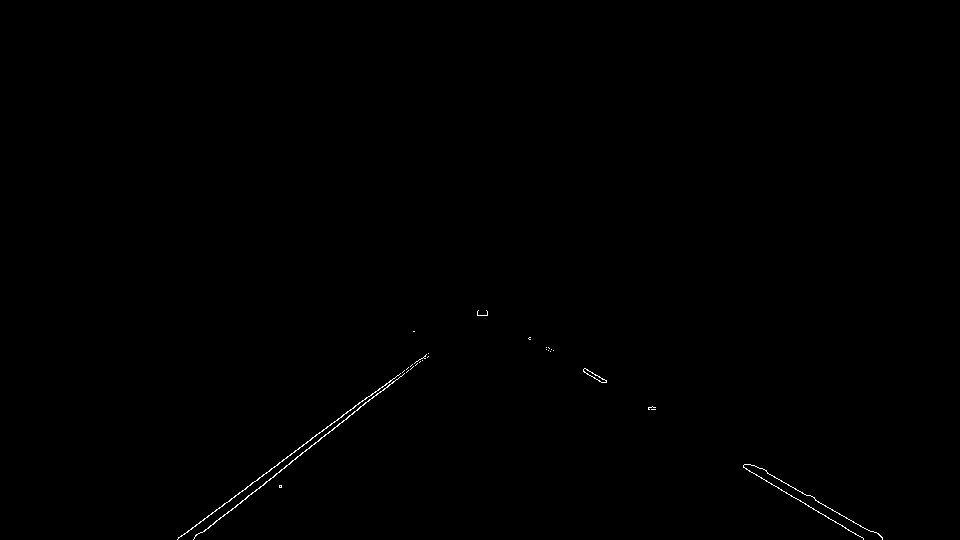

**Finding Lane Lines on the Road**

The goals / steps of this project are the following:
* Make a pipeline that finds lane lines on the road
* Reflect on your work in a written report

---

### Reflection

### 1. Describe your pipeline. As part of the description, explain how you modified the draw_lines() function.

My pipeline consisted of 6 steps.

1. Converted to gray scale

2. Gaussian filtering

3. Extraction of white or yellow color using thresholds

4. Canny edge detection

5. Mask except focusing region

6. Drawing lines

In order to draw a single line on the left and right lanes, I modified the draw_lines() function as below.

1. Edges is classified into left lane or right lane or else using below rule.
  - Rule:
    - Edges part of left lane satisfy ...
      - Both endpoints should be in left half of image.
      - Slope should be more than -1 and less than -0.5. (NOTE: y-cordinate is bigger when the point is more below in image.)
    - Edges part of right lane satisfy ...
      - Both endpoints should be in right half of image.
      - Slope should be more than 0.5 and less than 1.
    - Other edges are ignored.

2. Slope of lane is calculated using the average of atan2 of edges' slopes.
3. Intersect of lane is calculated using the average of edges' x-coordinates and y-coordinates and slope (calculated in ii)
  - intersect = (average of y) - slope * (average of x)
4. draw lines in range: (y-coordinate of top edges' endpoints) <= y <= (bottom of image)

If you'd like to include images to show how the pipeline works, here is how to include an image:

### 2. Identify potential shortcomings with your current pipeline

One potential shortcoming is vulnerable to changes in the brightness. For example, when lane is in shadow, lane cannot be detected.

### 3. Suggest possible improvements to your pipeline

A possible improvement

1. Use the other color space such as HSV or HLS.
2. Use the other edge detection method.
3. Use time-series data (suppose lane position changes not so much)
